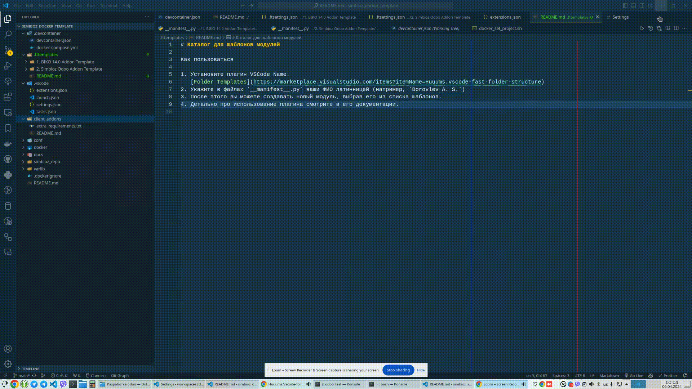

# Каталог для шаблонов модулей

Как пользоваться

1. Установите плагин VSCode Name:
   [Folder Templates](https://marketplace.visualstudio.com/items?itemName=Huuums.vscode-fast-folder-structure)
2. Укажите в файлах `__manifest__.py` ваши ФИО латинницей (например, `Borovlev A. S.`)
3. После этого вы можете создавать новый модуль, выбрав его из списка шаблонов.

4. Детально про использование плагина смотрите в его документации.
