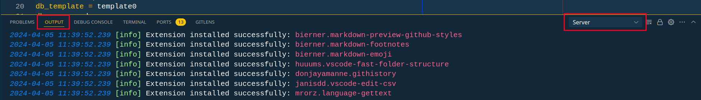

# Шаблон для настройки рабочего пространства для проекта odoo

## Структура каталога проекта

```
main_project_folder
  ├── .vscode
    ├── каталог с настройками рабочего пространства
  ├── .devcontainer
    ├── каталог с настройками dev-контейнера
  ├── simbioz_repo
    ├── каталоги репозитария сборки simbioz
  ├── client_addons
    ├── каталоги дополнительных модулей
  ├── docker
    ├── тут файл Dockerfile для формирования образа odoo
  ├── varlib
    ├── каталог для filestore odoo и для хранения сессий. Очень важно проверить доступы к этому каталогу пользователю докера
  └── conf
    ├── каталог с конфигурационными файлами
```

В каталог `simbioz_repo` нужно клонировать репозиторий именно сборки (AMS, CRMS и т.д).

Также в этот же каталог подключаются другие модули сборки, которые изначально не входили в поставку.
_Подключение модулей к сборке - отдельная тема, которая не касается этого документа._

В каталог `client_addons` клонируется репозитарий с модулями для конкретного клиента. В эту
папку можно склонировать несколько репозитариев и разложить их по подпапкам. <br/>

> [!IMPORTANT]
> Обязательно нужно убедиться, что каталог varlib доступен для записи пользователя, под которым все работает в докере. <br/>
> В Dockerfile указано ID пользователя и группы 1000. Есть два варианта решения проблемы с доступом к папке:
>
> 1.  Дать доступ на запись всем пользователям и группам (`chmod 777 varlib`)
> 2.  Определить ID пользователя под которым запускается докер (текущий пользователь системы обычно) и в Dockerfile для создаваемого пользователя указать эти ID.
>
> Более детально - см. документацию по докеру.

Вся настройка рабочего пространства для проекта настроена именно на эту структуру каталогов. Если нужно поменять структуру - нужно будет исправить настройки рабочего пространства.

## Порядок работы с репозитарием

1. Определите название проекта (например, muztorg)
2. Создайте папку этого проекта и перейдите в нее (например, `mkdir muztorg && cd muztorg`)
3. Склонировать репозитарий в папку проекта и удалить из него папку .git (т.е. просто отключить отслеживание изменений, т.к. мы будем клонировать другие репозитарии в папки и нам нет смысла что-то тут отслеживать)

   ```bash
   git clone git@github.com:biko-solutions/simbioz_docker_template.git . && rm -rf .git
   ```

4. Из папки `simbioz_repo` удалить все файлы и склонировать репозитарий сборки ([см. ниже](https://github.com/biko-solutions/simbioz_docker_template#%D0%B3%D0%B4%D0%B5-%D0%B1%D1%80%D0%B0%D1%82%D1%8C-%D1%81%D0%B1%D0%BE%D1%80%D0%BA%D0%B8))
5. Если есть репозитарий клиента, то из папки `client_addons` удалить все файлы и склонировать репозитарий с модулями клиента. **_Если разработка не под клиента, а для сборки, то каталог не трогать и ничего в нем не удалять._**
6. Открыть каталог в IDE
7. Провести настройку путей к модулям odoo `conf/odoo-server.conf` (см. комментарии в самом файле)

### Для работы в VSCode

1. Работа в VSCode подразумевает использование расширения Dev Containers. Перед началом работы убедитесь, что установлено расширение [Remote Development](https://marketplace.visualstudio.com/items?itemName=ms-vscode-remote.vscode-remote-extensionpack)
2. При открытии каталога в VSCode он предложит открыть сразу в dev-container
   

> [!CAUTION]
> Открывать можно только тогда, когда все настройки будут сделаны и репозитарии склонированы

3. **После настройки всех параметров и клонирования репозитариев** нужно открыть каталог в dev-container. Для этого нажмите на значок в левом нижнем углу и выберите "Reopen in Container"
   

> [!NOTE]
> На момент версии 1.88.0 в VSCode наблюдаются проблемы с автоматической установкой extensions. Поэтому, если при открытии контейнера вы не видите установленных расшерений, то их нужно установить вручную в разделе Extensions
> В сам проект добавлен список рекомендуемых расширений
>
> 
>
> Устанавливать их лучше по одному, но в принципе можно попробовать и сразу все. Следите за ошибками в разделе Output
>
> 

## Где брать сборки

#### Для AMS-проекта клонируем так:

```bash
cd main_project_folder/simbioz_repo
git clone --recurse-submodules git@gitlab.simbioz.com.ua:simbioz_dev/oms.git .
git submodule foreach -q --recursive 'branch="$(git config -f $toplevel/.gitmodules submodule.$name.branch)"; git checkout $branch'
```

#### Для проекта CRMS клонируем так:

```bash
cd main_project_folder/simbioz_repo
git clone --recurse-submodules git@gitlab.simbioz.com.ua:simbioz_dev/sbe.git .
git submodule foreach -q --recursive 'branch="$(git config -f $toplevel/.gitmodules submodule.$name.branch)"; git checkout $branch'
```

#### Для проекта GMS клонируем так:

```bash
cd main_project_folder/simbioz_repo
git clone --recurse-submodules git@gitlab.simbioz.com.ua:simbioz_dev/gms.git .
git submodule foreach -q --recursive 'branch="$(git config -f $toplevel/.gitmodules submodule.$name.branch)"; git checkout $branch'
```
